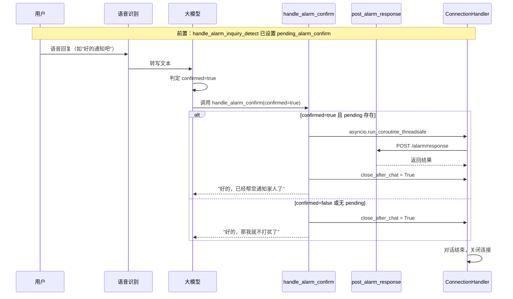

## 用户需求

编写一个新插件 `handle_alarm_confirm`，在告警确认流程中供 LLM 调用：

- 当用户**确认告警**时 → 调用 `post_alarm_response` 接口通知后端 → 退出对话
- 当用户**不确认**时 → 直接退出对话（不调用接口）

## 产品概述

该插件是系统控制类函数（SYSTEM_CTL），由 LLM 在对话中根据用户意图判定后自动调用。它桥接了告警确认逻辑与对话退出逻辑，确保告警结果被正确记录到后端系统。

## 核心功能

- LLM 根据用户语音回复判定 `confirmed` 参数（true/false）
- 确认时异步调用 `post_alarm_response` 接口，传递 session_id、confirmed=true 等信息
- 取消时跳过接口调用，直接退出对话
- 无论接口调用成功或失败，均设置退出标志并返回适当回复
- 防御性检查 `pending_alarm_confirm` 状态是否存在，避免空指针异常

## 技术栈

- 语言：Python（同步函数 + 异步桥接）
- 注册机制：`@register_function` 装饰器，`ToolType.SYSTEM_CTL`
- 异步桥接：`asyncio.run_coroutine_threadsafe` 将异步 `post_alarm_response` 投递到 `conn.loop` 执行
- 返回类型：`ActionResponse(action=Action.RESPONSE, result=..., response=...)`

## 实现方案

### 核心策略

完全对齐项目现有的插件模式（`handle_exit_intent.py` + `hass_play_music.py`），复用 `asyncio.run_coroutine_threadsafe` 桥接模式解决同步插件函数无法直接 `await` 异步函数的限制。

### 数据流



### 关键实现细节

1. **异步桥接**：由于 `plugin_executor.py` 第 33 行 `result = func_item.func(conn, **arguments)` 为同步调用（不 await），插件函数必须是同步的。参考 `hass_play_music.py` 的模式，使用：

```python
future = asyncio.run_coroutine_threadsafe(
post_alarm_response(api_base_url, session_id, True, text),
conn.loop
)
```

2. **防御性设计**：函数始终注册为必要函数（加入 `necessary_functions`），但内部先检查 `conn.pending_alarm_confirm` 是否存在、是否有效，避免在没有告警上下文时误操作。

3. **退出保证**：无论 `post_alarm_response` 调用成功还是失败，均在 `finally` 或异常处理后设置 `conn.close_after_chat = True` 并清理 `pending_alarm_confirm`。

4. **复用现有常量**：引用 `alarmConfirmHandler.py` 中的 `DEFAULT_CONFIRM_REPLY` 和 `DEFAULT_CANCEL_REPLY` 作为默认回复文案。

## 目录结构

```
main/xiaozhi-server/
├── plugins_func/functions/
│   └── handle_alarm_confirm.py          # [NEW] 告警确认插件。实现 handle_alarm_confirm 同步函数：
│                                           - 接收 conn 和 confirmed(bool) 参数
│                                           - conconfirmed=true 时通过 asyncio.run_coroutine_threadsafe 
│                                             桥接调用 post_alarm_response 异步接口
│                                           - 设置 conn.close_after_chat = True 退出对话
│                                           - 返回 ActionResponse 含适当回复文案
│                                           - 完整的异常捕获与日志记录
├── core/providers/tools/server_plugins/
│   └── plugin_executor.py              # [MODIFY] line 57，在 necessary_functions 列表中加入
│                                          "handle_alarm_confirm"，确保函数始终可用
└── core/handle/
    └── alarmConfirmHandler.py          # [REFERENCE] 引用其中的 post_alarm_response、
                                           DEFAULT_CONFIRM_REPLY、DEFAULT_CANCEL_REPLY
```

## 代理扩展

无需使用任何扩展。本任务为纯代码实现，不涉及外部工具、浏览器自动化或技能系统。